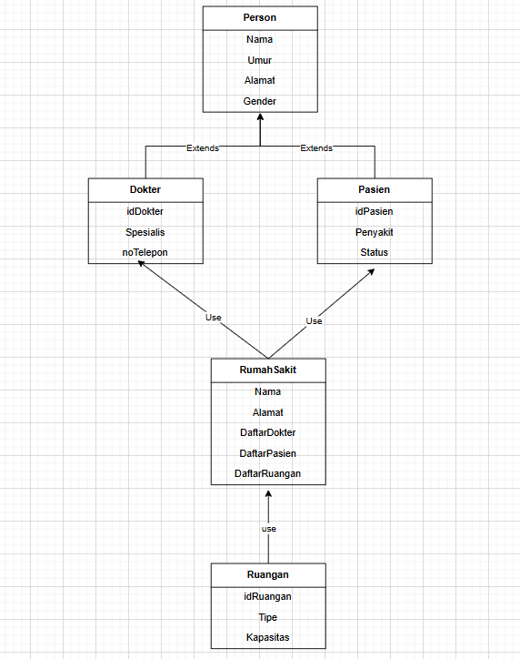

# TP3DPBO2425C2

Saya Fauzia Rahma Nisa mengerjakan Tugas Praktikum 3 dalam mata kuliah Desain dan Pemrograman Berdasarkan Objek untuk keberkahanNya maka saya tidak melakukan kecurangan seperti yang telah dispesifikasikan. Aamiin.

**A. Desain Diagram Program**
Program ini terdiri dari lima kelas utama, yaitu Person, Docter, Pasien, Ruangan, dan RumahSakit. Hubungan antar kelas dirancang menggunakan konsep inheritance dan composition.
- Person menjadi kelas dasar yang berisi atribut umum seseorang.
- Doctor dan Patient mewarisi atribut dari kelas Person dan juga menambahkan atribut khusus masing-masing.
- RumahSakit berperan sebagai pengelola utama data dokter, pasien, serta ruangan melalui composition (hubungan “has-a”).
- RumahSakit memiliki hubungan composition dengan Ruangan, dokter, pasien  
- Struktur relasinya dapat digambarkan seperti ini:

**B. Atribut & Method**
1. Person (Superclass)

Atribut:
- nama (string) → Nama lengkap individu
- umur (int) → Umur individu
- alamat (string) → Alamat tempat tinggal
- gender (string) → Jenis kelamin

Method:

- virtual void tampilkanInfo() → Method virtual yang berfungsi untuk menampilkan informasi dasar dari objek Person.
  Karena dideklarasikan sebagai virtual, method ini akan dioverride oleh subclass Dokter dan Pasien agar masing-masing dapat menampilkan informasi spesifiknya.
- Konsep ini merupakan contoh nyata dari polimorfisme pada program.

2. Dokter (Subclass dari Person)
   
Atribut tambahan:

- spesialis (string) → Bidang keahlian dokter
- idDokter (string) → ID unik dokter
- notelp (string) → Nomor telepon dokter

Method:

- void tampilkanInfo() override → Mengoverride method dari Person untuk menampilkan informasi dokter secara lengkap, termasuk atribut yang diwarisi dari Person dan atribut khusus dokter.

3. Pasien (Subclass dari Person)
   
Atribut tambahan:

- status (string) → Status perawatan pasien (misalnya: Rawat Inap atau Rawat Jalan)
- penyakit (string) → Jenis penyakit yang diderita pasien
- idPasien (string) → ID unik pasien

Method:

- void tampilkanInfo() override → Mengoverride method dari Person untuk menampilkan informasi pasien secara lengkap, baik atribut yang diwarisi maupun atribut spesifik pasien.

4. Ruangan
   
Atribut:

- id (string) → ID unik ruangan
- tipe (string) → Jenis ruangan (misalnya: ICU, Kelas 1, dll.)
- kapasitas (int) → Jumlah maksimal pasien yang dapat ditampung

Method:

- void tampilkanInfo() → Menampilkan detail ruangan termasuk daftar pasien yang menempatinya.

5. RumahSakit
   
Atribut:

- nama (string) → Nama rumah sakit
- alamat (string) → Alamat rumah sakit
- daftarDokter (List<Dokter>) → Daftar seluruh dokter yang bekerja di rumah sakit
- daftarPasien (List<Pasien>) → Daftar seluruh pasien yang terdaftar
- daftarRuangan (List<Ruangan>) → Daftar seluruh ruangan yang tersedia

Method:

- void tambahDokter(Dokter d) → Menambahkan objek dokter ke dalam daftar dokter rumah sakit.
- void tambahPasien(Pasien p) → Menambahkan objek pasien ke dalam daftar pasien rumah sakit.
- void tambahRuangan(Ruangan r) → Menambahkan objek ruangan ke dalam daftar ruangan rumah sakit.
- void tampilkanSemuaData() → Menampilkan seluruh data rumah sakit secara lengkap, termasuk informasi setiap dokter, pasien, dan ruangan beserta pasien yang menempatinya.

**C. Desain Program**

  Pertama, inheritance diterapkan dengan menjadikan kelas Doctor dan Pasien sebagai subclass dari kelas Person. Hal ini dilakukan karena keduanya memiliki atribut dasar yang sama seperti nama, umur, alamat, dan gender. Dengan inheritance, atribut dan method umum hanya perlu ditulis sekali di kelas Person, lalu diwarisi oleh kelas turunan. Selain itu, method tampilkanInfo() pada Person bersifat virtual dan dioverride oleh Doctor serta Pasien untuk menampilkan informasi yang lebih spesifik. 

  Selanjutnya, konsep composition digunakan pada kelas RumahSakit. Objek RumahSakit memiliki daftar Doctor, Pasien, dan Ruangan. Artinya, keberadaan objek-objek tersebut bergantung pada rumah sakit. jika objek RumahSakit dihapus, maka seluruh data dokter, pasien, dan ruangan juga ikut terhapus. hal ini membuktikan bahwa dokter, pasien, dan ruangan hanya relevan selama rumah sakit tersebut ada. Kelas RumahSakit juga menyediakan method penting seperti tambahDokter(), tambahPasien(), tambahRuangan(), dan tampilkanSemuaData() untuk mengelola seluruh data tersebut.

  Terakhir, program juga menerapkan hierarki kelas, terutama dalam versi Java. Pada level paling dasar terdapat Person sebagai superclass, kemudian Doctor dan Pasien sebagai subclass yang mewarisinya. Di sisi lain, RumahSakit berperan sebagai kelas utama yang mengelola semua data, dan Ruangan menjadi kelas pendukung yang terhubung melalui komposisi.
  
**D. Alur Program**

  Program diawali dengan membuat objek RumahSakit berisi informasi dasar seperti nama dan alamat rumah sakit. Setelah itu, data awal dokter, pasien, dan ruangan dimasukkan menggunakan method tambahDokter(), tambahPasien(), dan tambahRuangan(). Setiap method tersebut akan membuat objek baru (Doctor, Pasien, atau Ruangan) lalu menyimpannya di dalam daftar milik RumahSakit (composition).

  Setelah data awal tersimpan, program menampilkan seluruh informasi melalui tampilkanSemuaData(). Di sini, konsep inheritance berjalan karena Doctor dan Pasien mewarisi atribut dan method dari Person, serta menggunakan polimorfisme saat menjalankan tampilkanInfo() sesuai jenis objeknya.

  Selanjutnya, program kembali menambahkan beberapa data baru dan menampilkan ulang seluruh informasi untuk memperlihatkan pembaruan tersebut. Proses ini mencerminkan alur sistem manajemen rumah sakit, mulai dari inisialisasi data, penambahan data baru, hingga penampilan informasi secara terstruktur berdasarkan hubungan hierarkis antara kelas induk dan turunannya.
